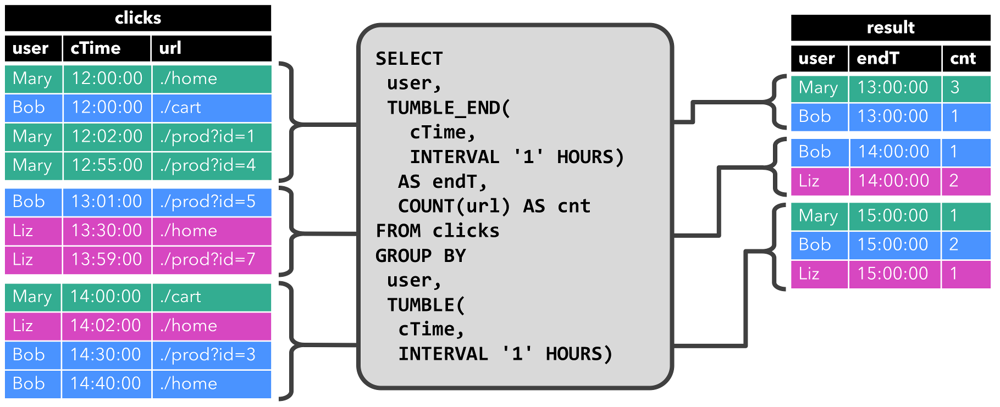
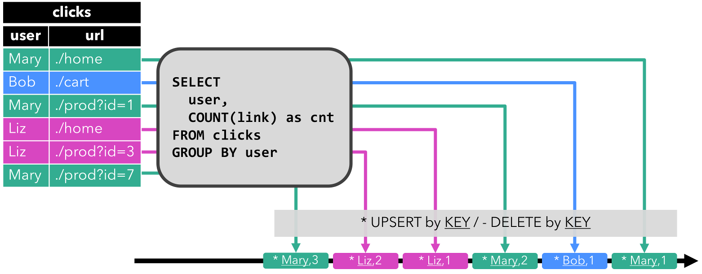

# 动态表

SQL和关系代数的设计没有考虑到流数据。因此，关系代数\(和SQL\)与流处理之间几乎没有概念上的差异。

本页面讨论了这些差异，并解释了Flink如何在无界数据上实现与有界数据上的常规数据库引擎相同的语义。

## 数据流上的关系查询

下表比较了传统的关系代数和流处理，包括输入数据、执行和输出结果。

| 关系代数/SQL | 流处理 |
| :--- | :--- |
| 关系（或表）是有界（多）元组的集合。 | 流是无限的元组序列。 |
| 对批处理数据执行的查询（例如，关系数据库中的表）可以访问完整的输入数据。 | 流式查询在启动时无法访问所有数据，必须“等待”数据流入。 |
| 批处理查询在生成固定大小的结果后终止。 | 流式查询会根据收到的记录不断更新其结果，并且永远不会完成。 |

尽管存在这些差异，但使用关系查询和SQL处理流并非不可能。高级关系数据库系统提供一个称为物化视图的特性。物化视图定义为SQL查询，就像常规虚拟视图一样。与虚拟视图不同，物化视图缓存查询结果，这样在访问视图时就不需要计算查询。缓存的一个常见挑战是防止缓存提供过时的结果。当修改其定义查询的基表时，物化视图将过时。_Eager View Maintenance_是一种在更新基表后立即更新物化视图的技术。

如果我们考虑以下因素，那么_Eager View Maintenance_和流上的SQL查询之间的关系就变得很明显:

* 数据库表是`INSERT`，`UPDATE`和`DELETE`DML语句的一个结果_流_，通常被称为_更新日志流_。 
* 物化视图定义为SQL查询。为了更新视图，查询会持续处理视图基本关系的更改日志流。
* 物化视图是流式SQL查询的结果。

考虑到这些要点，我们将在下一节中介绍以下动态表的概念。

## 动态表与连续查询

动态表是Flink的Table API和SQL支持流数据的核心概念。 与表示批处理数据的静态表相比，动态表随时间而变化，可以像静态批处理表一样查询它们。 查询动态表会产生连续查询。 连续查询永远不会终止并生成动态表作为结果。 查询不断更新其（动态）结果表以反映其（动态）输入表的更改。 实质上，动态表上的连续查询与定义物化视图的查询非常相似。

重要的是要注意，连续查询的结果总是在语义上等同于在输入表的快照上以批处理模式执行的相同查询的结果。

下图展示了流，动态表和连续查询的关系：


1. 流转换为动态表。
2. 在动态表上评估连续查询，生成新的动态表。
3. 生成的动态表将转换回流。


注意:动态表首先是一个逻辑概念。在查询执行期间，动态表不一定\(完全\)具体化。


下面，我们将用具有以下模式的单击事件流来解释动态表和连续查询的概念:

```text
[
  user:  VARCHAR,   // the name of the user
  cTime: TIMESTAMP, // the time when the URL was accessed
  url:   VARCHAR    // the URL that was accessed by the user
]
```

## 在流上定义表

为了使用关系查询处理流，必须将其转换为表。从概念上讲，流的每个记录都被解释为结果表上的插入修改。本质上，我们是在从一个仅插入的changelog流上构建一张表。

下图展示了单击事件流\(左侧\)如何转换为表\(右侧\)。随着单击流的记录越来越多，结果表不断增长。



注意:在流上定义的表在内部没有具体化。


### 连续查询

在动态表上对连续查询进行计算，并生成新的动态表。与批处理查询不同，连续查询从不根据输入表上的更新来终止和更新其结果表。在任何时间点上，连续查询的结果在语义上都等同于在输入表的快照上以批处理模式执行的相同查询的结果。

在下面的例子中，我们展示了在click事件流中定义的clicks表上的两个查询。

第一个查询是一个简单的分组计数聚合查询。它对clicks表上的用户字段进行分组，并计算访问的URL数。下图显示了在`clicks`使用其他行更新表时，如何评估查询。


当查询启动时，单击表\(左侧\)是空的。当第一行插入到click表中时，查询开始计算结果表。插入第一行\[Mary， ./home\]之后，结果表\(右侧，顶部\)由一行\[Mary, 1\]组成。当将第二行\[Bob， ./cart\]插入到click表中时，查询将更新结果表并插入新行\[Bob, 1\]。第三行\[Marry，/prod?id=1\]生成已计算结果行的更新，使\[Mary, 1\]更新为\[Mary, 2\]。最后，当第4行附加到click表时，查询将第三行\[Liz, 1\]插入到结果表中。

第二个查询与第一个查询类似，但在计算url数量之前，除了user属性外，还将click表分组到每小时滚动窗口上\(windows等基于时间的计算基于特殊的时间属性，后面将讨论这些属性\)。图中再次展示了不同时间点的输入和输出，以可视化动态表不断变化的特性。



与前面一样，输入表clinks显示在左侧。查询每小时持续计算结果并更新`result`表。click表包含四行时间戳\(cTime\)，时间戳在12:00:00到12:59:59之间。查询从这个输入计算两个结果行\(每个用户一个\)，并将它们追加到`result`表中。对于13:00:00到13:59:59之间的下一个窗口，`clicks`表包含三行，这导致另外两行被追加到`result`表中。`clicks`表随着时间的推移会附加更多行，`result`表也会更新。

### 更新并追加查询

尽管两个示例查询看起来非常相似（都计算了分组计数聚合），但它们在一个重要方面有所不同：

* 第一个查询更新以前发出的结果，即定义结果表的更改日志流包含`INSERT`和`UPDATE`更改。
* 第二个查询仅附加到结果表，即结果表的更改日志流仅包含`INSERT`更改。

查询是否生成仅追加的表或更新的表具有以下含义:

* 产生更新更改的查询通常必须维护更多的状态\(请参见下一节\)。 
* 将仅追加的表转换为流与将更新的表转换为流是不同的\(请参阅[表到流转换](https://ci.apache.org/projects/flink/flink-docs-master/dev/table/streaming/dynamic_tables.html#table-to-stream-conversion)一节\)。

### 查询限制

许多\(但不是所有\)语义有效的查询都可以作为流上的连续查询进行计算。有些查询的计算开销太大，要么是因为它们需要维护的状态的大小，要么是因为计算更新的开销太大。

* _**状态大小**_:连续查询是在无界流上的计算，通常需要运行数周或数月。因此，连续查询过程的数据总量可能非常大。必须更新以前发出的结果的查询需要维护所有发出的行，以便能够更新它们。例如，第一个示例查询需要存储每个用户的URL计数，以便在输入表接收到新行时能够增加计数并发送新的结果。如果只跟踪注册用户，则维护的计数可能不会太高。但是，如果非注册用户获得分配的唯一用户名，则要维护的计数数量将随着时间的推移而增加，并可能最终导致查询失败。

```sql
SELECT user, COUNT(url)
FROM clicks
GROUP BY user;
```

* _**计算更新**_:即使只添加或更新了单个输入记录，某些查询也需要重新计算和更新大部分发出的结果行。显然，这样的查询不太适合作为连续查询执行。下面的查询是一个示例，它根据最后一次单击的时间为每个用户计算一个等级。一旦`clinks`表接收到新行，就会更新用户的`lastAction`，并且必须计算新的排名。然而，由于两行不能具有相同的等级，因此所有排名较低的行也需要更新

```sql
SELECT user, RANK() OVER (ORDER BY lastLogin)
FROM (
  SELECT user, MAX(cTime) AS lastAction FROM clicks GROUP BY user
);
```

“ [查询配置”](https://ci.apache.org/projects/flink/flink-docs-master/dev/table/streaming/query_configuration.html)页面讨论了控制连续查询执行的参数。一些参数可用于交换维持状态的大小以获得结果准确性。

## 表到流到转换

动态表可以像常规数据库表一样，通过插入、更新和删除更改来不断修改。它可能是一个只有一行的表\(不断更新\)，一个只有插入的表\(没有更新和删除修改\)，或者介于两者之间。

将动态表转换为流或将其写入外部系统时，需要对这些更改进行编码。Flink的表API和SQL支持三种方法来编码动态表的更改：

* **仅追加流\(Append-only stream\):** 仅通过`Insert`更改修改的动态表可以通过发出插入的行转换为流。
* **回收流\(Retract stream\):**回收流是具有两种类型的消息的流，添加消息和回收消息。 通过将`INSERT`更改编码为添加消息，将`DELETE`更改编码为回收消息，将`UPDATE`更改编码为更新（先前）行的回收消息和更新（新）行的添加消息，将动态表转换为回收流。 下图显示了动态表到回收流的转换。


**更新插入流\(Upsert stream\):**upsert流是一种包含两种类型消息的流，包括Upsert消息和删除消息。 转换为upsert流的动态表需要（可能是复合的）唯一键。 通过将INSERT和UPDATE更改编码为upsert消息并将DELETE更改编码为删除消息，将具有唯一键的动态表转换为流。 流消耗运算符需要知道唯一键属性才能正确应用消息。 与回收流的主要区别在于UPDATE更改使用单个消息进行编码，因此更有效。 下图显示了动态表到upsert流的转换。



在[Common Concepts](https://ci.apache.org/projects/flink/flink-docs-master/dev/table/common.html#convert-a-table-into-a-datastream)页面上讨论了将动态表转换为DataStream的API。 请注意，将动态表转换为DataStream时，仅支持**附加\(Append\)**和**回收\(Retract\)**流。 [TableSourc](https://ci.apache.org/projects/flink/flink-docs-master/dev/table/sourceSinks.html#define-a-tablesink)[s和TableSink](https://ci.apache.org/projects/flink/flink-docs-master/dev/table/sourceSinks.html#define-a-tablesink)页面讨论了向外部系统发出动态表的TableSink接口。

