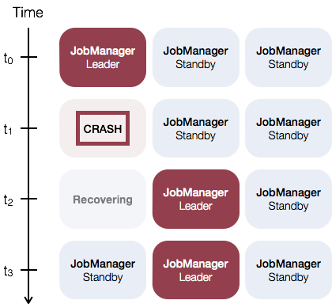

# 高可用\(HA\)

## Standalone集群高可用



### 配置

**示例: 2个JobManager的Standalone集群**

1.在`conf/flink-conf.yaml`中配置高可用模式和ZooKeeper quorum:

```text
high-availability: zookeeper
high-availability.zookeeper.quorum: localhost:2181
high-availability.zookeeper.path.root: /flink
high-availability.cluster-id: /cluster_one # important: customize per cluster
high-availability.storageDir: hdfs:///flink/recovery
```

2.在`conf/masters`中**配置masters**

```text
localhost:8081
localhost:8082
```

3.在`conf/zoo.cfg`中**配置zookeeper servers**\(目前每台机器只能运行一台ZooKeeper服务器\):

```text
server.0=localhost:2888:3888
```

4.**启动ZooKeeper quorum**:

```text
$ bin/start-zookeeper-quorum.sh
Starting zookeeper daemon on host localhost.
```

5.**启动一个高可用集群**

```text
$ bin/start-cluster.sh
Starting HA cluster with 2 masters and 1 peers in ZooKeeper quorum.
Starting jobmanager daemon on host localhost.
Starting jobmanager daemon on host localhost.
Starting taskmanager daemon on host localhost.
```

6.**停止ZooKeeper quorum和集群：**

```bash
$ bin/stop-cluster.sh
Stopping taskmanager daemon (pid: 7647) on localhost.
Stopping jobmanager daemon (pid: 7495) on host localhost.
Stopping jobmanager daemon (pid: 7349) on host localhost.
$ bin/stop-zookeeper-quorum.sh
Stopping zookeeper daemon (pid: 7101) on host localhost.
```

## Yarn集群高可用

### 配置

```markup
<property>
  <name>yarn.resourcemanager.am.max-attempts</name>
  <value>4</value>
  <description>
    The maximum number of application master execution attempts.
  </description>
</property>
```

```text
yarn.application-attempts: 10
```

#### **示例: 高可用YARN Session**

1.在`conf/flink-conf.yaml`中**配置高可用模式和ZooKeeper quorum**:

```text
high-availability: zookeeper
high-availability.zookeeper.quorum: localhost:2181
high-availability.storageDir: hdfs:///flink/recovery
high-availability.zookeeper.path.root: /flink
yarn.application-attempts: 10
```

2.在`conf/zoo.cfg`中**配置zookeeper servers**\(目前每台机器只能运行一台ZooKeeper服务器\):

```text
server.0=localhost:2888:3888
```

3.**启动ZooKeeper quorum**:

```text
$ bin/start-zookeeper-quorum.sh
Starting zookeeper daemon on host localhost.
```

4.**启动一个高可用集群**

```text
$ bin/yarn-session.sh -n 2
```

## Zookeeper安全配置

```text
zookeeper.sasl.service-name: zookeeper     # default is "zookeeper". If the ZooKeeper quorum is configured
                                           # with a different service name then it can be supplied here.
zookeeper.sasl.login-context-name: Client  # default is "Client". The value needs to match one of the values
                                           # configured in "security.kerberos.login.contexts".
```

## 引导Zookeeper

```text
server.X=addressX:peerPort:leaderPort
[...]
server.Y=addressY:peerPort:leaderPort
```

