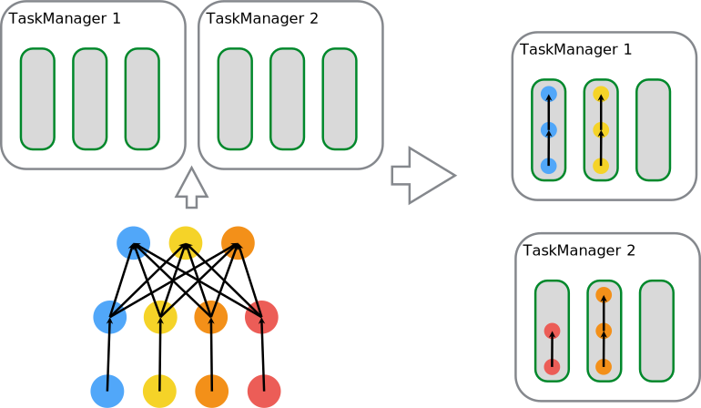
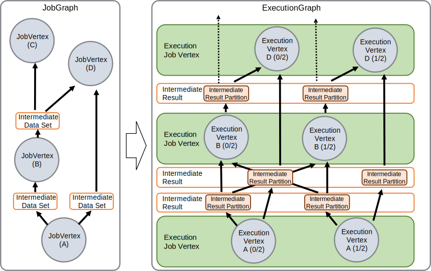

# 任务和调度

## 调度

Flink中的执行资源通过任务槽定义。每个TaskManager都有一个或多个任务槽，每个槽都可以运行一个并行任务管道。流水线由多个连续的任务构成。请注意，Flink经常同时执行连续任务：对于流程序，无论如何都会发生，但对于批处理程序，它经常发生。

下图说明了这一点。考虑一个带有数据源，MapFunction和ReduceFunction的程序。源和MapFunction以4的并行度执行，而ReduceFunction以3的并行度执行。管道由序列Source - Map - Reduce组成。在具有2个TaskManagers且每个具有3个插槽的群集上，程序将按如下所述执行。

在内部，Flink定义通过SlotSharingGroup和CoLocationGroup 哪些任务可以共享的Slot（许可），哪些任务必须严格放置到相同的Slot。

## JobManager数据结构

在作业执行期间，JobManager会跟踪分布式任务，决定何时安排下一个任务（或一组任务），并对已完成的任务或执行失败做出反应

JobManager接收[JobGraph](https://github.com/apache/flink/blob/master//flink-runtime/src/main/java/org/apache/flink/runtime/jobgraph/)，它是由运算符（JobVertex）和中间结果（IntermediateDataSet）组成的数据流的表示。每个运算符都具有属性。此外，JobGraph还有一组附加库，这些库是执行操作符代码所必需的。

JobManager将JobGraph转换为ExecutionGraph。ExecutionGraph是JobGraph的并行版本：对于每个JobVertex，它包含每个并行子任务的ExecutionVertex。并行度为100的运算符将具有一个JobVertex和100个ExecutionVertices。ExecutionVertex跟踪特定子任务的执行状态。来自一个JobVertex的所有ExecutionVertices都保存在 ExecutionJobVertex中，它跟踪整个运营商的状态。除了顶点之外，ExecutionGraph还包含IntermediateResult和IntermediateResultPartition。前者跟踪IntermediateDataSet的状态，后者是每个分区的状态。

每个ExecutionGraph都有一个与之关联的作业状态。此作业状态指示作业执行的当前状态。

Flink作业首先处于创建状态，然后切换到运行，并在完成所有工作后切换到已完成。如果出现故障，作业将首先切换为取消所有正在运行的任务的失败。如果所有作业顶点都已达到最终状态且作业无法重新启动，则作业将转换为失败。如果可以重新启动作业，则它将进入重新启动状态。作业完全重新启动后，将达到创建状态。

如果用户取消作业，它将进入取消状态。这还需要取消所有当前正在运行的任务。一旦所有正在运行的任务都达到最终状态，作业将转换为已取消的状态。

与完成，取消和失败的状态不同，它表示全局终端状态，因此触发清理作业，暂停状态仅在本地终端。本地终端意味着作业的执行已在相应的JobManager上终止，但Flink集群的另一个JobManager可以从持久性HA存储中检索作业并重新启动它。因此，到达暂停状态的作业将不会被完全清除。

在执行ExecutionGraph期间，每个并行任务都经历多个阶段，从创建到完成或失败。下图说明了它们之间的状态和可能的转换。可以多次执行任务（例如，在故障恢复过程中）。因此，在Execution中跟踪ExecutionVertex的执行。每个ExecutionVertex都有一个当前的Execution和先前的Executions。

