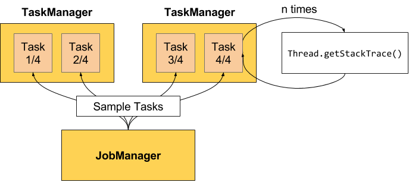
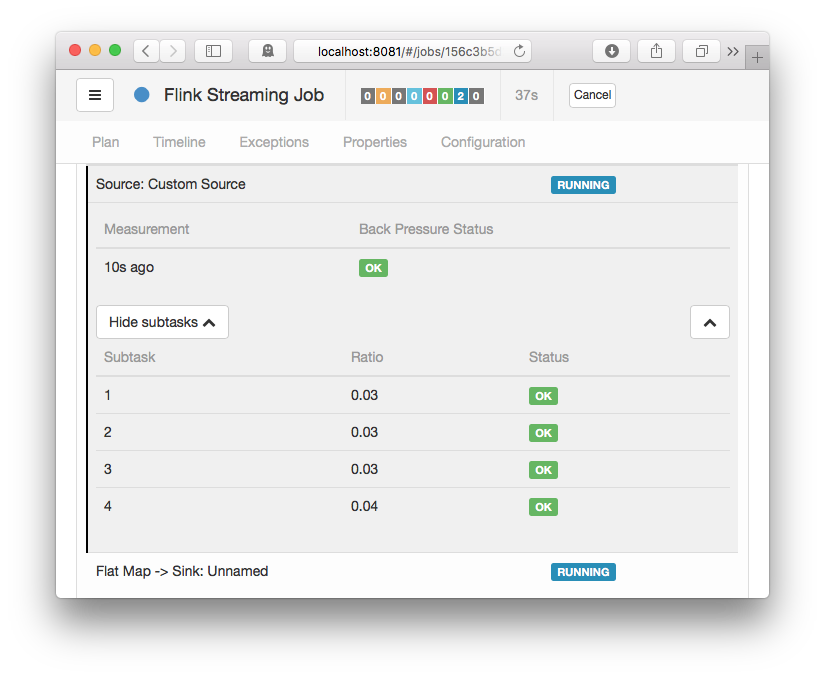

# 监测背压

## 背压

如果您看到任务的**背压警告**（例如`High`），这意味着它生成的数据比下游操作员可以消耗的速度快。下游工作流程中的记录（例如从源到汇）和背压在相反的方向上传播，沿着流向上传播。

以一个简单的`Source -> Sink`工作为例。如果您看到警告`Source`，这意味着`Sink`消耗数据的速度比`Source`生成速度慢。Sink背压会给上游Operator Source施加压力。

## 采样线程

背压监测通过反复获取正在运行的任务的堆栈跟踪样本来工作。JobManager会触发对作业`Thread.getStackTrace()`任务的重复调用

如果示例显示任务线程卡在某个内部方法调用中（从网络堆栈请求缓冲区），则表示该任务存在背压。

默认情况下，`JobManager`为每个任务每50ms触发100个堆栈跟踪，以确定背压。在Web界面中看到的比率告诉您在内部方法调用中有多少这些堆栈跟踪被卡住，例如`0.01`表示该方法中只有1个被卡住。

* **OK**：0 &lt;= Ratio &lt;= 0.10
* **LOW**：0.10 &lt;Ratio &lt;= 0.5
* **HIGH**：0.5 &lt;Ratio &lt;= 1

为了不让堆栈跟踪示例使JobManager过载，web界面只在60秒后刷新示例。

## 配置

您可以使用以下配置键配置JobManager的样本数：

* web.backpressure.refresh-interval:统计数据的刷新时间间隔\(默认值:60000,1分钟\)
* web.backpressure.num-samples:堆栈跟踪样本的数量，以确定背压\(默认值:100\)。 
* web.backpressure.delay-between-samples:堆栈跟踪采样之间的延迟，以确定背压\(默认值:50ms\)。

## 示例：

您可以在作业概述旁边找到“_Back Pressure”_选项卡。

### 正在进行抽样

这意味着JobManager触发了正在运行的任务的堆栈跟踪示例。对于默认配置，这大约需要5秒完成。

请注意，单击该行将触发此操作符的所有子任务的示例。

### 背压状态

如果您看到任务的状态**正常**，则表示没有背压指示。另一方面，**HIGH**表示任务处于背压状态

